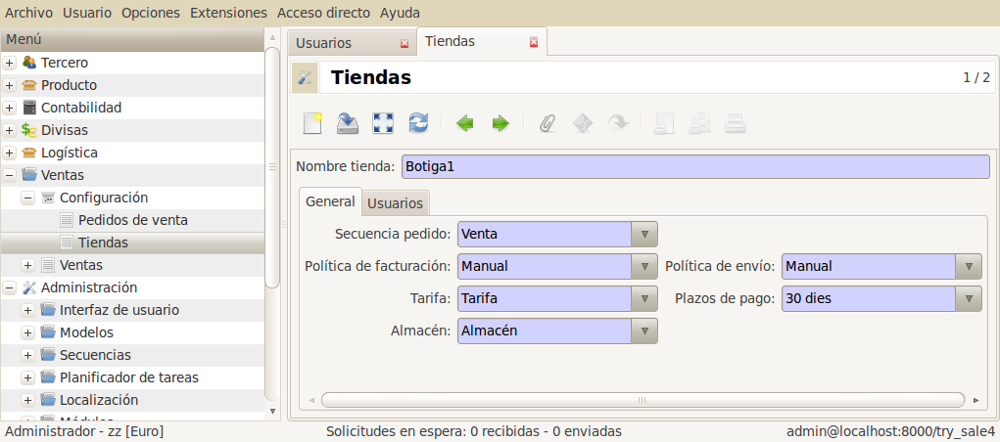

#:before:sale/sale:section:configuracion#

Tiendas
=======

La opción de tiendas en los pedidos de venta le permitirá establecer una organización
de tiendas (físicas o virtuales) y usuarios por cada tienda.

A |menu_sale_shop| agregaremos una nueva tienda con la información:

* |shop_name|: Nombre de la tienda
* |shop_users|: Usuarios que tendrán acceso a esta tienda.
* |shop_warehouse|: Almacén principal que opera esta tienda.
* |shop_price_list|: Tarifa de venta para esta tienda.
* |shop_payment_term|: Plazos de pago para esta tienda.
* |shop_sale_sequence|: Numeración que usará los pedidos de esta tienda.
* |shop_sale_invoice_method|: Método de facturación que usará esta tienda.
* |shop_sale_shipment_method|: Métode de envío que usará esta tienda.
* |shop_company|: Empresa de esta tienda.

.. |menu_sale_shop| tryref:: sale_shop.menu_sale_shop/complete_name
.. |shop_name| field:: sale.shop/name
.. |shop_users| field:: sale.shop/users
.. |shop_warehouse| field:: sale.shop/warehouse
.. |shop_price_list| field:: sale.shop/price_list
.. |shop_payment_term| field:: sale.shop/payment_term
.. |shop_sale_sequence| field:: sale.shop/sale_sequence
.. |shop_sale_invoice_method| field:: sale.shop/sale_invoice_method
.. |shop_sale_shipment_method| field:: sale.shop/sale_shipment_method
.. |shop_company| field:: sale.shop/company

Usuarios
--------

A |menu_user| podrá añadir o agregar a que tiendas pueden crear
pedidos. A parte, dispone del campo en que tienda esta activo en este momento.

.. |menu_user| tryref:: res.menu_user_form/complete_name

Preferencias
------------

Los usuarios pueden cambiar de tienda mediante sus preferencias
(Menú superior/Preferencias) y decidir en que tienda están en este momento
creando/editando pedidos.

   Configuración de tiendas en Tryton

Pedidos
-------

En el momento de crear un pedido nuevo, este se le asigna a una tienda. Este campo
es requerido y de solo lectura, por tanto, si un usuario no tiene acceso a ninguna
tienda, no podrá generar pedidos, aunque tenga roles de creación de pedidos.

.. note::  Para crear pedidos de venta a parte de disponer de los grupos
           relacionados a ventas, el usuario deberá pertenecer a una o varias
           tiendas.
